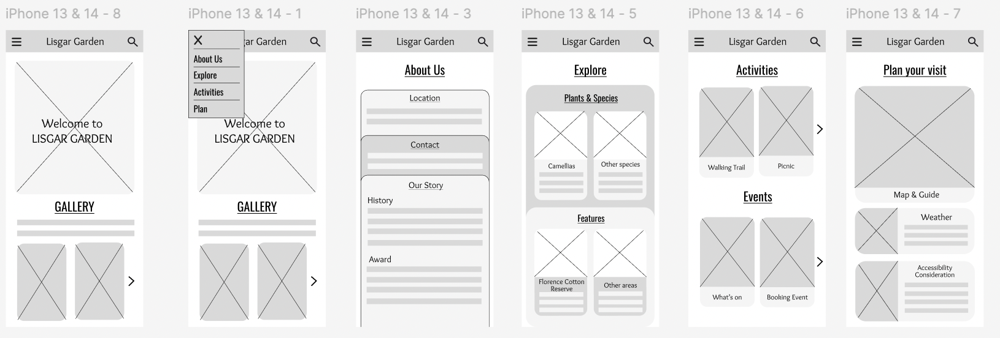
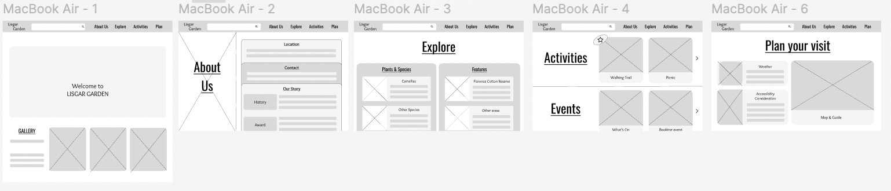
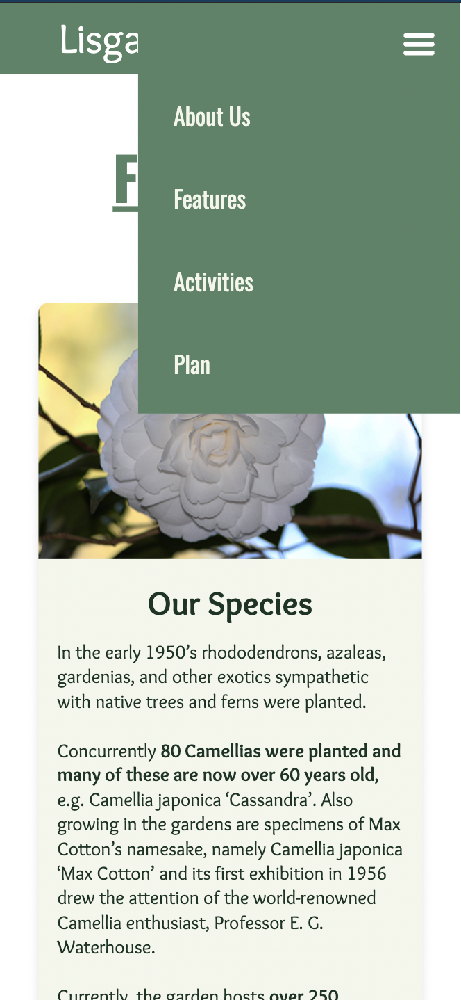
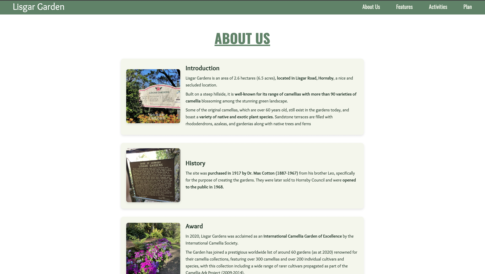
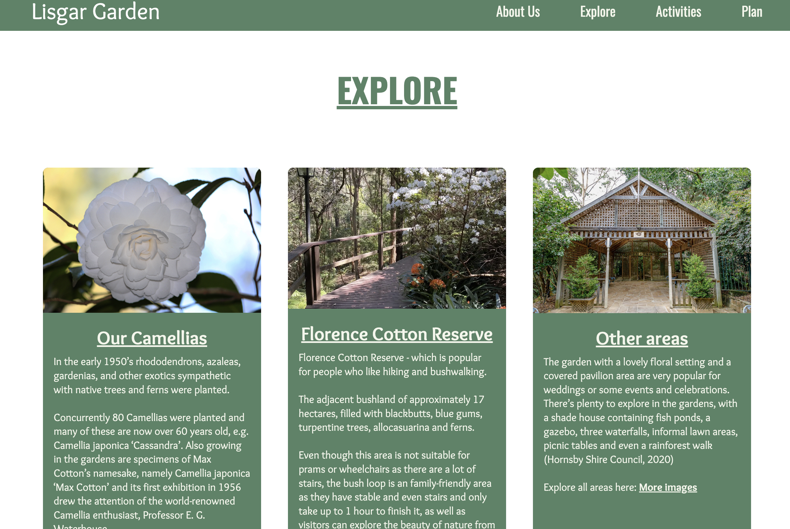
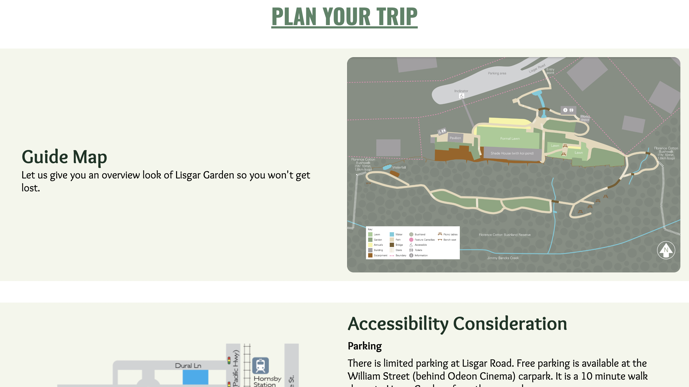
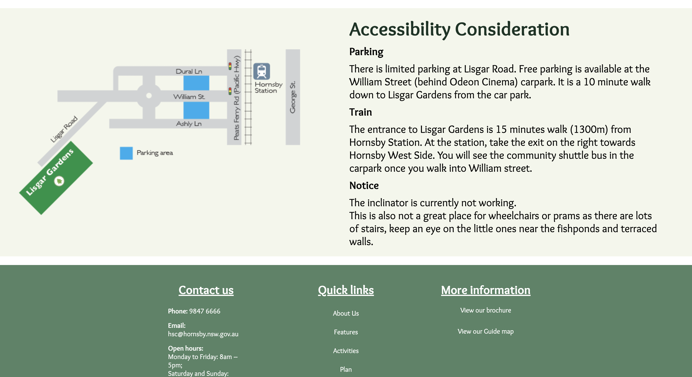
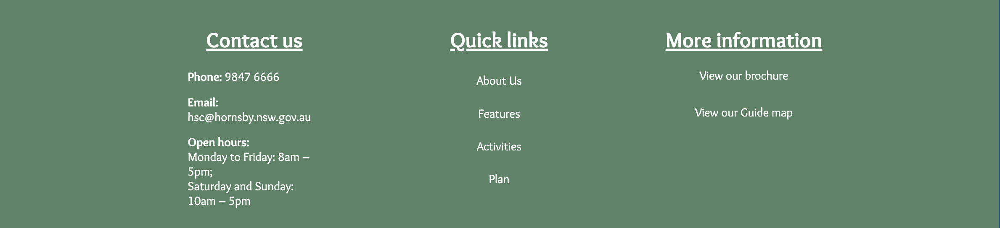

# Lisgar Garden Website

## Justifications for implementation decisions

**Target audience**

- Photographers, who loves nature and looking for a natural place for their photoshoot.
- Parents with children, looking for a nice place for family outing such as picnic, hiking.

**Aim**: 
- Based on my target users, the website was designed to be visually engaging yet simple and intuitive for everyone to use. 
- It should be informative about the location, accessibility and activities to satisfy my target audiences 
- Responsive website to be accessible across devices, allowing users to explore activities and plan their visits.

**Website aesthetic**:

- **Color scheme**: 
 As my location is a Lisgar Garden, I want to choose the green color palette to demonstrate the nature theme. Therefore, I pick green as my primary color, applied it for my navigation bar, footer section and title text of each page. And two other colors which are creamy white as secondary color and darker green to use for contents.
- **Font choice**:
The fonts “Oswald” and “Overlock” from Google Fonts were chosen for their readability (thick and bold)and visual appeal that align well with my website's aesthetic.

- **Access of information**: I want my users to be able to access to the information they need quickly, so my navigation bar and the footer will appear at every page.
- **Layout**: most information will be put in card with images and texts content, the title of each is straightfoward and key information will be bold so they can grab the important information quickly

- **Accessibility considerations** : Include text contrast ratios, alt text for images, and reduced motion for transitions.

## Reflection
- Most of my code worked well and responsive, the only problem I encountered is my navigation bar is not responsive on mobile screen. 
- I followed the instruction from this Youtube Video: https://www.youtube.com/watch?v=5NEUGWSD-BE. The dropdown menu was hidden on the desktop screen but on a smaller screen, it just moved away -900px to the right side, which then led my screen to be like this: 
 
- Yet, I’m not sure how to fix this problem since if I click on the menu button and the dropdown appears, then the screen is responsive and not being zoomed out like the above issue, but when I close the dropdown, it occurs again.
- I think this might be the problem of the “right: -800px” but if I deleted this line, then the dropdown will appear on the screen all the time, which is worse. 

## Wireframes vs. Final Prototype
Comparing initial wireframes with the final prototype reveals several updates based on user feedback and my ability in coding those feature.

This is my mid-fidelity wireframe:

**Key feedbacks from Prototype's User testing**
- Ensure consistency in the layout and orientation of titles across the website pages.
- Adding a footer for better navigation on mobile, instead of a search bar.
- The menu should be on the right side for easier navigation with the thumb.
- Overlay title on the image may have readability problem.

**Key changes**
1. **Mobile Navigation Bar**:
   - **Position of the dropdown menu on mobile device**: I changed the dropdown menu from the left side to the right side as most people are right-handed so placing the navigation button on the right side will be more convenient for them to press on it. 

2. **About Us page layout**:
- Get rid of the overlay title on image and arrange the title vertically.
- I changed from stacked card on scroll layout into 3 separated cards stacked vertically, simplify the layout to enhance the accessibility for all user.

3. **Explore page layout**
- Shorten the content by merging two plant sections together. 
- Change the layout into horizontal cards with images above the texts.

4. **Activities page layout**
- Create overlay texts appear when hovering at the images to describe each section, and external links for detailed information/booking action.

5. **Plan page layout**
- Change the layout from cards with horizontal to separated sections lays vertically.

6. **Footer**:
- Adding footer that include contact information, quick navigation links and links to detailed brochure of the park, for all pages.

## Further Iterations and Improvements
After conducting user testing on my website, few additional changes were made to improve the user experience and functionality of the website:

**Key feedbacks from User testing:**
- Fix the responsive navigation menu on mobile (❌- as said in the Reflection part)
- Increase the font size for the content on the website, especially overlay text on mobile screen. ✅
- Consider making key information more visually prominent, such as by bolding key words.✅
- Make the homepage link more noticeable, so users can easily navigate back to the main page. ✅

1. **External links's appearance**:
- Changing external link's color from white to yellow/purple to make it noticeable and different from normal text so user can know they're clickable. I also made it change to green/yellow when the mouse hovers on it.
Before:

After:

When hover on the link:

2. **Change to improve the accessibility**:

***Color change***
- For content text and container card, I chose light cream as my secondary color. At first, I mostly use green as background colors for most cards and creamy white for the text. However, after checking the the accessibility, the contrast score it's quite low (3.97), so I only used that for the menu bar and footer section, which don't have much words to ensure it's visibility.
- Therefore, I reverse the color use as creamy white for card's background color and darker green for the text, which significantly improved my contrast score to 12.34, improved the accessibility of my website.

***Highlight some keywords in long text content***
- I also make some keywords bold so the user can grab the important information quickly from a long text.

3. **Clarify the content of the page**
- The user get confused at "Explore" section as they not sure what does it include until they click on it. Therefore, I changed from "Explore" to "Features", which is descriptive itseld without needing further explanation.

**Demonstrate for 2.,3. changes:**

Before:

After:

4. **Hovering effect for Lisgar Garden logo**
- This change was made since some users were unsure where to click at to go back to home page. So I made the logo (which has the link to go back to homepage) has a frame around it when hovering.
 

## References
The following resources were referenced for images, text content, and code examples:

1. **Images + Content**: 

ReferencesAllTrails. (n.d.). Lisgar Garden Walk. AllTrails. https://www.alltrails.com/trail/australia/new-south-wales/lisgar-gardens-walk

Baber, S. (2021). Lisgar Gardens – Escape and Explore. Escapeandexplore.com.au. https://escapeandexplore.com.au/experience/lisgar-gardens/

Celebrant, E. S. (2014). A pretty garden wedding in Hornsby. Blogspot.com. https://elainesearlecelebrant.blogspot.com/2014/11/a-pretty-garden-wedding-in-hornsby.html

Friends of Lisgar Gardens. (2014, May 26). Photo Gallery. Friends of Lisgar Gardens. https://lisgarfriends.wordpress.com/photo-gallery/

Friends of Lisgar Gardens. (2019, July 25). Community Events – Friends of Lisgar Gardens. Friends of Lisgar Gardens. https://lisgarfriends.wordpress.com/category/community-events/Hills 

District Mums HQ. (2023, June 20). Lisgar Gardens & Florence Cotton Reserve Hornsby | Bush walks for kids - Hills District Mums. Hills District Mums. https://hillsdistrictmums.com.au/lisgar-gardens-florence-cotton-reserve/?fbclid=IwY2xjawFVzg1leHRuA2FlbQIxMAABHQpTkCx6A7sg7PjU-VIMkYXhz2ParGFonTsPoYD-G_UATN9RA7WwP_vqdw_aem_yO-iqI0NiEztmD02Wt9jjA

Hornsby Shire Council. (2020, December 7). Hornsby Shire Council - Lisgar Gardens. Hornsby Shire Council. https://www.hornsby.nsw.gov.au/lifestyle/sports-and-recreation/parks-and-playgrounds/lisgar-gardens

Hornsby Shire Council. (2024). Lisgar Gardens. Hornsby Shire Council. https://discoverhornsby.com/parks/lisgar-gardens/

International Camellia Society. (2024). Lisgar Gardens. Internationalcamellia.org. https://internationalcamellia.org/en-us/oceania-gardens-of-excellence/lisgar-gardens

Kirri. (2014). Lisgar Garden-Captured by Kirri. Captured by Kirri. https://www.capturedbykirri.com.au/locations/lisgar-gardens

Tripadvisor. (2024). Lisgar Gardens - Hornsby. Tripadvisor. https://www.tripadvisor.com.au/Attraction_Review-g255060-d10164378-Reviews-Lisgar_Gardens_Hornsby-Sydney_New_South_Wales.html

走南闯北的猫 . (2023). Lisgar Garden [Photo]. In Sohu. https://www.sohu.com/a/720417723_121119245

2. **Code**:
These are video tutorials that I followed:

CodingNepal. (2023, June 28). Create A Simple Responsive Website in HTML and CSS | Responsive Website HTML and CSS. YouTube. https://www.youtube.com/watch?v=VPml28EBEI8

Learn Web. (2023, June 9). Creating Responsive CSS Cards | Card Design HTM & CSS. YouTube. https://www.youtube.com/watch?v=9FNNkzPBFcE&list=PLLBkka59CHwIzAZk8yjoE59YZ-Jf13J01&index=15

Online Tutorials. (2023, October 17). Infinite Scrolling Animation | CSS Only Text and Image Carousel. YouTube. https://www.youtube.com/watch?v=2l99ERCnB9c

Tarun Code . (2023). footer html css footer design in html css | Tarun Code. Www.youtube.com. https://www.youtube.com/watch?v=dlsjiphBris

